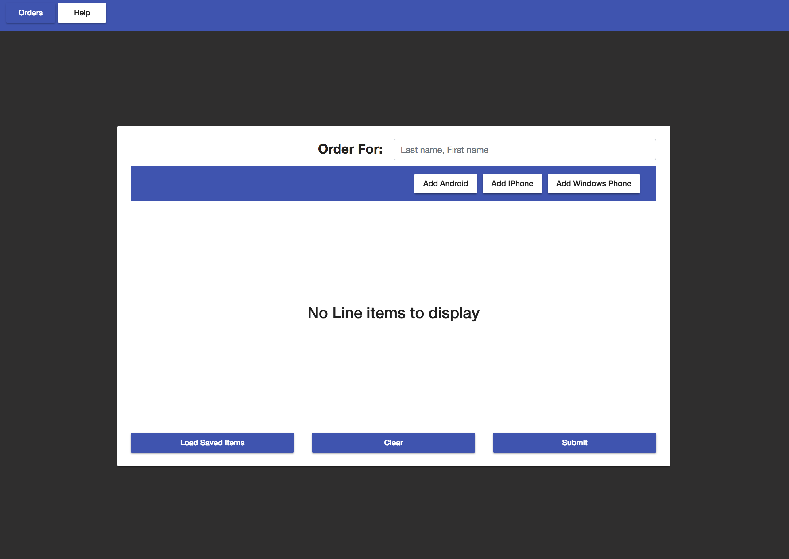
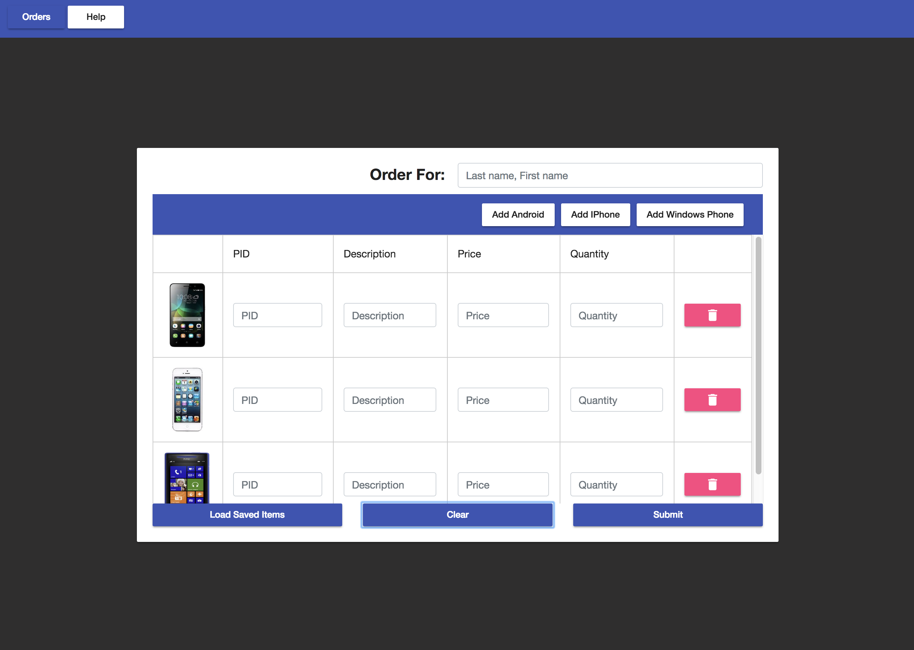
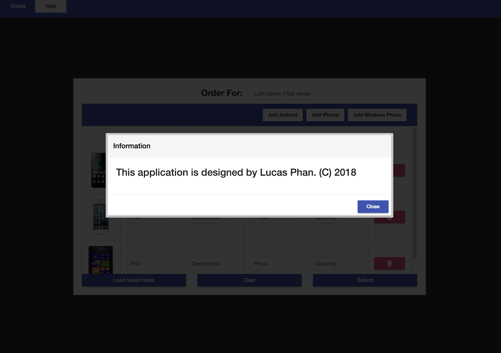
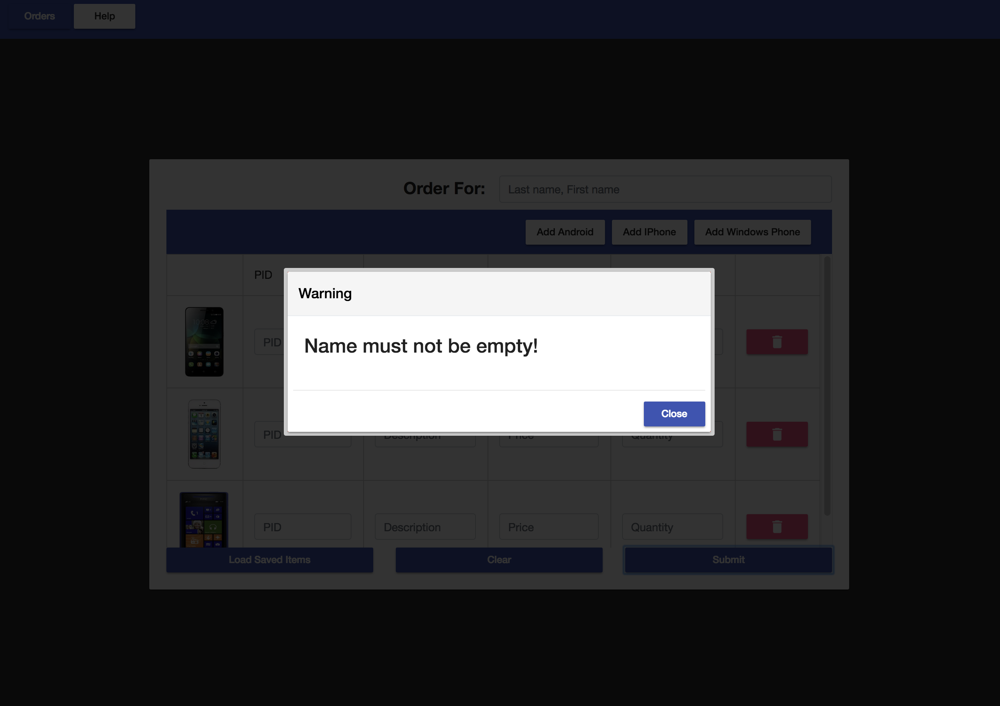
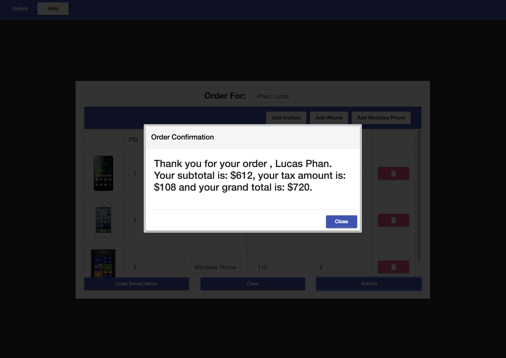

# Exam 1

## Instructions

### Computer Solution Problem (50 points)

1. Written component 25pts (~ 25 minutes)
2. GITFlow component 25pts (~ 10 minutes)
3. Code component 50pts (~ 75 minutes)

You can use any resources including  your books, notes, and memos for completing this part of
the test; however, you cannot ask, share, or consult with anyone in the world. You cannot use
the Internet for any searches or file sharing. It must be your own work. Any violation will
automatically issue a zero on the Exam.

GUI for the application is fully provided for you and you should not have to write any CSS or new HTML elements. Pull the application source code as specified according to the GITFlow section of this document. Change html of the components items and write all necessary codes and complete the application.

Push all the files onto your GITHub repo and change name of the top folder to
“IS51Test1” (corresponding to your GITHub repo) upon completion of test.

Make sure the computer, VS Code, and the files / application is all working properly with no errors or warnings.

### Code Component - Smart Phone Sales Project

You are hired to create a Web application to automate the sales process. The application should have a structure that stores the following part data: PID (a string), Description (a string), Price (a number) and Qauntity (an number). The company currently carries only three parts as shown in the table below and the application should use an array of three custom objects (interface). If you don’t know how to use an array of three object variables, you can use  array of objects instead with 5 points penalty.

#### PID Description Price Inventory
2. 1 Android 150.00 2
3. 2 IPhone 200.00 1
4. 3 Windows Phone 110.00 2

The data above is located in ```assets/orders.json``` for reference. 

Your application should allow the user to enter data for each item (quantity). When “Load Saved Items” button is clicked, populate the default sales data from the orders.json file and display the content on the table. PID, Description, Price and quantity should be displayed inside text input. The user will enter any quantity to order for each item. When “Submit” button is clicked, calculate the total order amount plus tax (15 % or .15) and display the result to the user in a flex-modal or alert message.

Help button displays a message, ```“This application is designed by <your name>. (C) 2018”``` in a “app-flex-modal” component (provided) or use an alert box less points.

When “Display Saved Items” button is clicked, the item from “orders.json” file should be displayed. Then the order information should be displayed as shown in the figure
below. Then, the user enters his/her name and any quantity to order for each item (Note: the format of name input ->; Lastname, Firstname; ex: Phan, Lucas). (comma with space between last name and first name) 

When “Clear” button is clicked, the Order form should be cleared (value set to null). 

When “Submit” button is clicked, calculate the subtotal, tax amount and total for the invoice (by calling a compute function). Display a success message to the user to indicate that the order was completed successfully. Perform string splicing to transform “LastName, FirstName” to “First Name Last Name” and the success message should read: “Thank you <First Name> <Last Name>. Here is your order details!”. (See screenshots)

### Validation (see screenshots below)

1. Name input field not specified.
2. Name not containing a “, ”.

Show the corresponding error message using the “app-flex-modal”. Alert message could be use for reduce points.

### Add Additional Items

The three buttons -> “Add Android, Add IPhone and Add Windows Phone", when click adds the corresponding item to the orders list with all fields (pid, description, price and quantity) matching to the corresponding item. Quantity however will be 1.


### Delete Item

When the delete button is pressed, delete the corresponding item from the list.


### Orders Page (before loading saved items from orders.json)


### Orders Page (after loading saved items from orders.json)


### Orders Page (after clear button pressed)



### Help Modal (show on Help button pressed)


### Validation Errors




### Success Message Modal (After Submit button is clicked and all validation has pass)


## Points Breakdown

1. Launch flex modal or alert showing about text 2.5pts ```“This application is designed by <your name>. (C) 2018”```
2. convert name from <Last Name>, <First Name> to <First Name> <Last Name> and display text 2.5 pts
3. Calculate sub total, tax amount and total 7.5pts
4. perform input validation
  ```
1. Name input field not specified. 5pts
2. Name not containing a “, ”. 5pts

  ```
5. Clear the orders form 2.5pts
6. Add items 'Android', 'IPhone' and 'Windows Phone' to list when corresponding button is clicked 7.5pts
7. delete line item (order) when delete button is click 7.5 pts
8. read in the orders.json file and populate the list table with the initial orders (3) 7.5pts
9. Display calculated results on a flex-modal (see screenshot) 2.5 pts